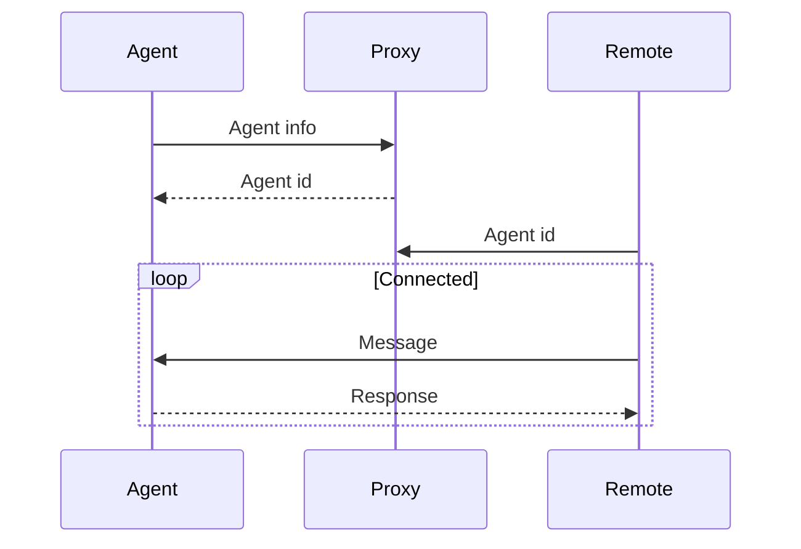

# Websocket Proxy

A two-way websocket proxy server for piping data between two clients.

The proxy differentiates between two kinds of clients: agents and remotes. Agents are clients that listen for messages, and optionally reply to them. Remotes are clients that want to connect to an agent.

## API

### `/agents`

A discovery endpoint which lists all agents in the local network (based on the request's public IP address).

### `/ws/agent` and `/ws/remote`

The websocket endpoints for the agent and remote clients, respectively.

## Websocket Protocol

When connecting to the proxy, the first message contains metadata about the agent or remote. For the agent this is a JSON object with the following properties:

| Property   | Description |
|------------|-------------|
| `version`  | The version of the agent.
| `address`  | The local address (IP and port) at which the agent is running.
| `platform` | The platform the agent is running on, e.g. `windows`, `linux` or `mac`.
| `hostname` | The name of the host the agent is running on.

The proxy will then assign a unique id to this agent, which remotes can use to identify it. It will also send a message containing this id to the agent.

For the remote this is a JSON object with the following properties:

| Property | Description |
|----------|-------------|
| `id`     | The id of the client to connect to.

### Diagram

