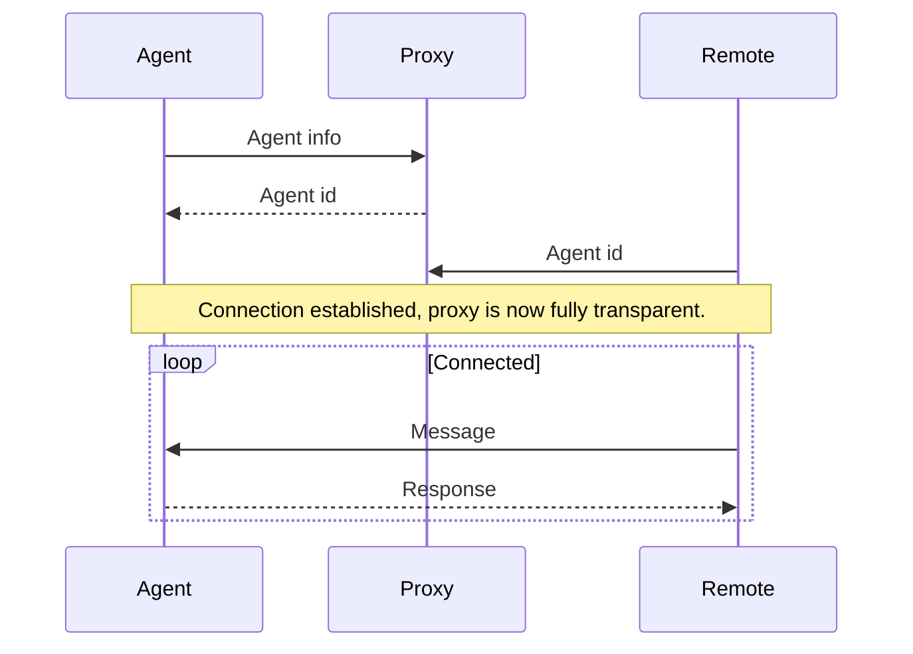

Go to https://mermaid-js.github.io/mermaid-live-editor to generate and download the image to use in the readme.

```mermaid
sequenceDiagram
    participant Agent
    participant Proxy
    participant Remote

    %% Register the agent.
    Agent->>Proxy: Agent info
    Proxy-->>Agent: Agent id

    %% Connect to an agent.
    Remote->>Proxy: Agent id

    Note over Agent,Remote: Connection established, proxy is now fully transparent.

    %% Connected, piping data.
    loop Connected
        Remote->>Agent: Message
        Agent-->>Remote: Response
    end
```
